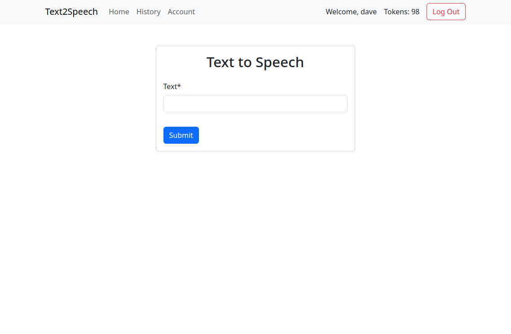

# Text2Speech Django App

Text2Speech is a Django web application that converts text into speech. Users can input text, choose voice options, and generate MP3 files of the converted speech.

## Features

- Convert text into speech with customizable voice options.
- Save generated MP3 files for future access.
- User authentication and account management.
- View conversion history and manage saved MP3 files.
- Responsive design for use on desktop and mobile devices.

## Installation

 Clone the repository:

   ```bash
   git clone https://github.com/your-username/text2speech-django.git

   cd text2speech-django

   python manage.py migrate

   python manage.py runserver
   ```

Access the application at http://localhost:8000/



